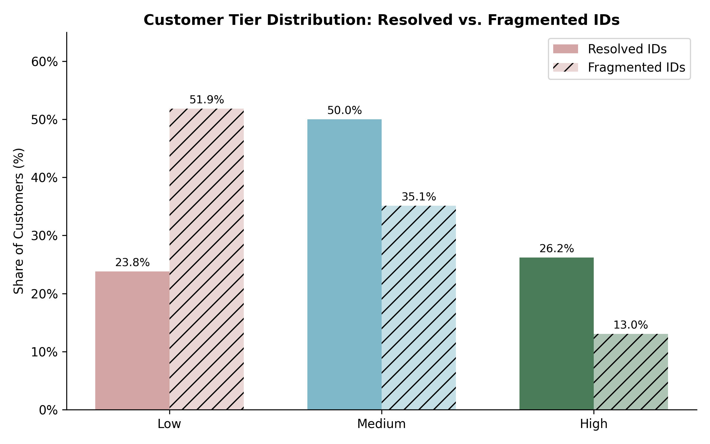
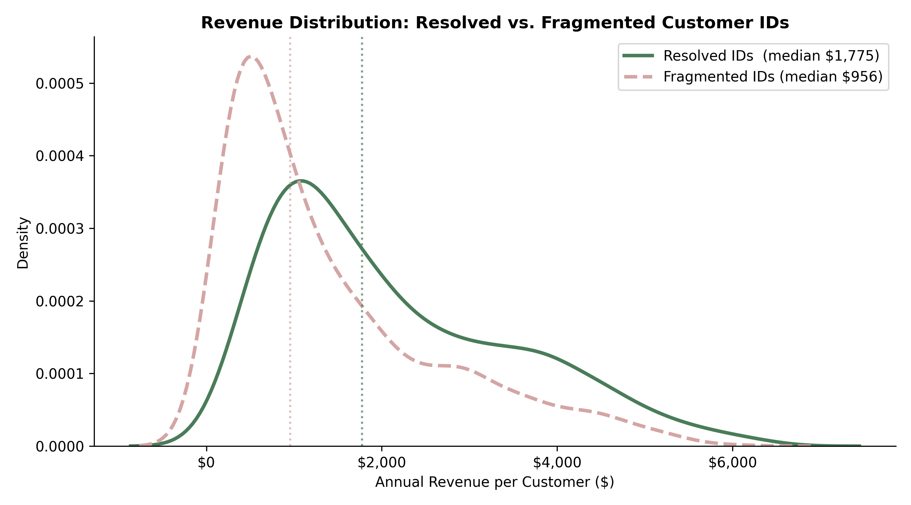
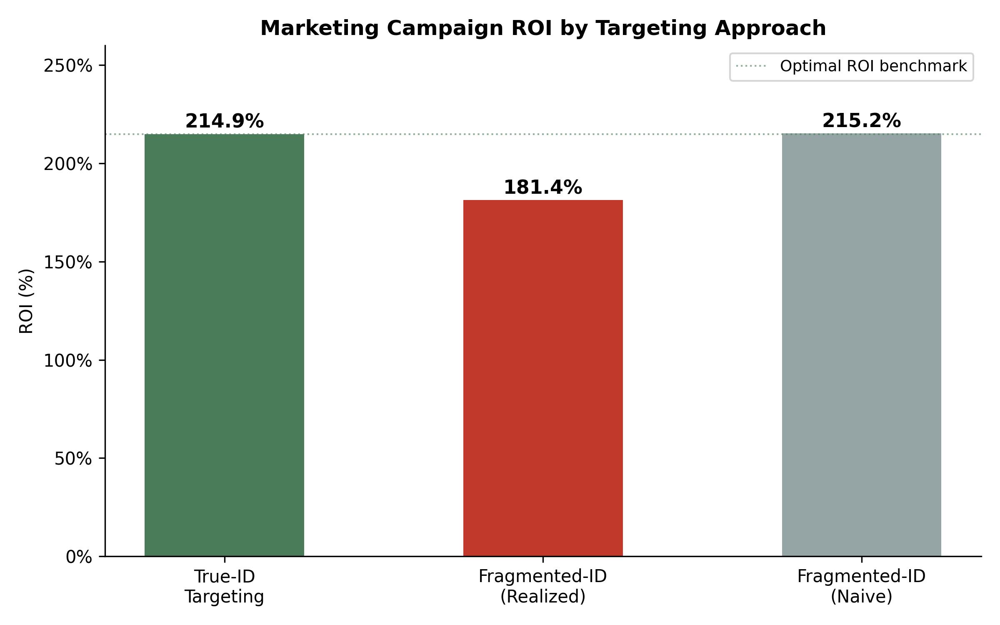
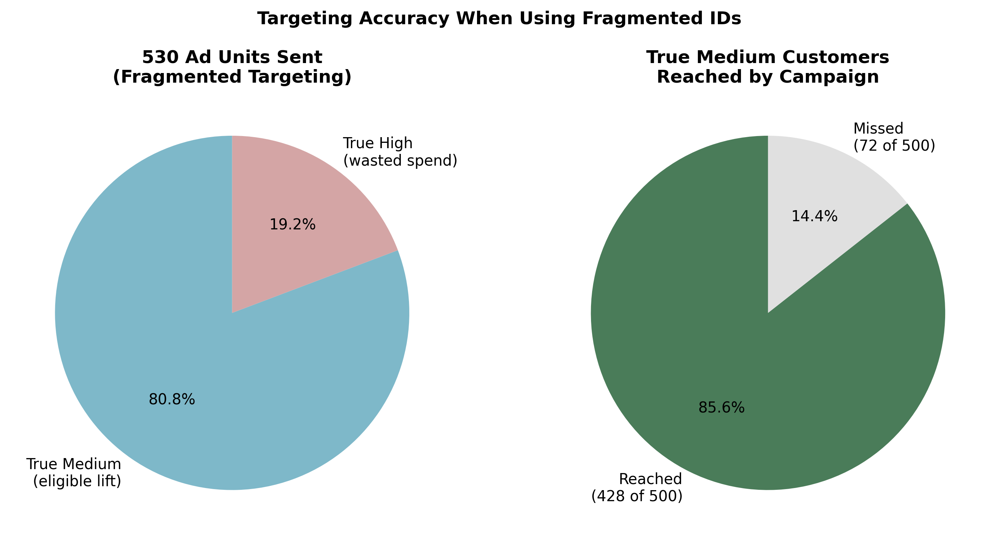

# Quantifying the Cost of Fragmented Customer Identity

## Problem

Retailers that operate across multiple brands often store customer activity in separate systems. When the same person shops across brands, that customer can appear as multiple records rather than one unified profile. This creates a distorted view of customer count, customer value, and campaign performance.

This project evaluates that distortion using a transaction dataset modeled on an Amperity identity resolution case. The goal is to quantify what happens to segmentation and marketing ROI when a business relies on fragmented customer IDs instead of a resolved customer view.

## Key Findings

- Customer count is overstated by 51%, rising from 1,000 true customers to 1,510 fragmented records.
- Average annual revenue per customer falls from $2,126.93 to $1,408.56 when spend is not consolidated across brands.
- High-value customers are materially undercounted: 26.2% of customers are high value in the resolved view versus 13.05% in the fragmented view.
- The low-value segment is overstated from 23.8% to 51.85%, making the customer base look less valuable than it actually is.
- A medium-tier upgrade campaign generates 114.91% ROI with resolved identities, but only 81.38% realized ROI when targeting is based on fragmented IDs.
- A naive marketer evaluating performance inside the same fragmented system would estimate ROI at 115.25%, which masks the targeting error and creates false confidence in campaign performance.

## Dataset

The analysis uses transaction-level data for 1,000 customers over one year across two brands. The dataset includes both a true customer identifier and an adulterated identifier that splits cross-brand shoppers into separate records. This structure makes it possible to compare business decisions under resolved and fragmented identity states.

Key variables used in the analysis:

| Variable | Description |
| --- | --- |
| `userid` | True customer identifier |
| `id_adulterated` | Fragmented identifier used when customer activity is not resolved across brands |
| `revenue` | Revenue generated by each transaction |
| `brand_type` | Brand associated with the transaction |
| `purchase_number` | Purchase sequence index |
| `age`, `gender` | Customer attributes included in the source data |

## Methodology

The analysis compares the business view under two identity conditions. First, customer revenue is aggregated using the true customer ID to establish the baseline distribution of customer value. Second, the same aggregation is repeated using fragmented IDs to simulate the firm's view without identity resolution.

Customers are then assigned to value tiers using the firm's revenue thresholds: low-value customers spend under $1,000 annually, medium-value customers spend between $1,000 and $3,000, and high-value customers spend above $3,000.

To quantify downstream business impact, the project models a direct marketing campaign aimed at moving medium-value customers into the high-value tier. The campaign assumes a $50 cost per targeted customer, a 30% profit margin, no incremental lift for high-value customers, and a 20% increase in annual spend for medium-value customers who are correctly reached.

Three ROI scenarios are evaluated:

1. Targeting with resolved customer IDs.
2. Targeting with fragmented IDs and measuring the realized outcome against true customers.
3. Targeting and evaluating performance entirely within the fragmented system.

This final scenario is especially important because it shows how poor identity quality can distort both targeting and measurement at the same time.

## Results

The resolved view shows a meaningfully stronger customer base than the fragmented view suggests. Median annual revenue drops from $1,775.06 to $955.84 when customer activity is split across multiple IDs. The 75th percentile falls from $3,086.50 to $1,959.50, which means many customers who should be treated as upper-tier customers appear only mid-tier or lower in the fragmented system.

| Tier | Resolved View | Fragmented View |
| --- | --- | --- |
| Low | 23.8% | 51.85% |
| Medium | 50.0% | 35.10% |
| High | 26.2% | 13.05% |





The campaign simulation shows why this matters commercially. With resolved IDs, the firm sends 500 offers, spends $25,000, and generates $53,727.29 in incremental profit for ROI of 114.91%. With fragmented IDs, the firm sends 530 offers and spends $26,500, but realized incremental profit drops to $48,065.38, reducing ROI to 81.38%.

The gap is driven by mistargeting. In the fragmented view, 102 high-value customers are incorrectly classified as medium and receive wasted marketing spend, while many true medium-value customers are not recognized as eligible targets when their spend is split across brands. Even more concerning, the naive fragmented evaluation estimates ROI at 115.25%, almost identical to the optimal result, because the same identity error distorts both who gets targeted and how performance is measured.

| Scenario | Ads Sent | Marketing Spend | Incremental Profit | ROI |
| --- | ---: | ---: | ---: | ---: |
| Resolved ID targeting | 500 | $25,000 | $53,727.29 | 114.91% |
| Fragmented ID targeting, realized outcome | 530 | $26,500 | $48,065.38 | 81.38% |
| Fragmented ID targeting, naive evaluation | 530 | $26,500 | $57,041.22 | 115.25% |





## Conclusion

This analysis shows that identity fragmentation is not just a data hygiene issue. It changes how valuable the customer base appears, weakens segmentation, and leads the business to spend marketing budget less efficiently than it should.

The most important takeaway is that fragmented IDs can also make performance measurement look better than it really is. That is what makes the problem dangerous. A firm can underperform in reality while still seeing metrics that suggest the campaign worked as intended.

One limitation is that the campaign simulation applies a uniform 20% lift to reached medium-value customers and does not model variation in customer responsiveness, retention, or lifetime value. Even with that simplification, the directional business impact of identity resolution is clear.

## Repository Structure

```text
.
├── 525701-XLS-ENG.xlsx
├── analysis.ipynb
├── outputs/
│   ├── customer_tier_distribution.png
│   ├── revenue_distribution_comparison.png
│   ├── roi_comparison.png
│   └── targeting_accuracy_breakdown.png
├── README.md
└── readme2
```

## How to Run

1. Open the project from the repository root.
2. Use the project virtual environment if needed: `source venv/bin/activate`
3. Launch the notebook: `jupyter notebook analysis.ipynb`
4. Run the notebook cells in order to reproduce the calculations and charts.

## Visualization Code

```python
import os
import numpy as np
import pandas as pd
import matplotlib.pyplot as plt
import matplotlib.ticker as mtick
import seaborn as sns

os.makedirs("outputs", exist_ok=True)

df = pd.read_excel("525701-XLS-ENG.xlsx", sheet_name="amperity_dataset")

bins = [0, 1000, 3000, np.inf]
labels = ["Low", "Medium", "High"]
order = ["Low", "Medium", "High"]

revenue_true = df.groupby("userid")["revenue"].sum().to_frame()
revenue_true["bucket"] = pd.cut(revenue_true["revenue"], bins=bins, labels=labels)

revenue_frag = df.groupby("id_adulterated")["revenue"].sum().to_frame()
revenue_frag["bucket"] = pd.cut(revenue_frag["revenue"], bins=bins, labels=labels)

palette = {"Low": "#D9A273", "Medium": "#6C8EAD", "High": "#355C4B"}

# Chart 1: Customer tier distribution
true_pct = revenue_true["bucket"].value_counts(normalize=True).reindex(order) * 100
frag_pct = revenue_frag["bucket"].value_counts(normalize=True).reindex(order) * 100

x = np.arange(len(order))
width = 0.35

fig, ax = plt.subplots(figsize=(8, 5))
bars1 = ax.bar(x - width / 2, true_pct, width, label="Resolved IDs", color=[palette[t] for t in order])
bars2 = ax.bar(x + width / 2, frag_pct, width, label="Fragmented IDs", color=[palette[t] for t in order], alpha=0.45, hatch="//")

for bar in [*bars1, *bars2]:
    ax.text(bar.get_x() + bar.get_width() / 2, bar.get_height() + 0.5, f"{bar.get_height():.1f}%", ha="center", fontsize=9)

ax.set_xticks(x)
ax.set_xticklabels(order)
ax.set_ylabel("Share of Customers")
ax.set_title("Customer Tier Distribution: Resolved vs. Fragmented")
ax.yaxis.set_major_formatter(mtick.PercentFormatter())
ax.legend()
plt.tight_layout()
plt.savefig("outputs/customer_tier_distribution.png", dpi=300)
plt.close()

# Chart 2: Revenue distribution comparison
fig, ax = plt.subplots(figsize=(9, 5))
sns.kdeplot(revenue_true["revenue"], ax=ax, linewidth=2.5, color="#355C4B", label="Resolved IDs")
sns.kdeplot(revenue_frag["revenue"], ax=ax, linewidth=2.5, linestyle="--", color="#D27D7D", label="Fragmented IDs")

ax.axvline(revenue_true["revenue"].median(), color="#355C4B", linestyle=":", alpha=0.7)
ax.axvline(revenue_frag["revenue"].median(), color="#D27D7D", linestyle=":", alpha=0.7)
ax.set_xlabel("Annual Revenue per Customer ($)")
ax.set_ylabel("Density")
ax.set_title("Revenue Distribution by Identity State")
ax.xaxis.set_major_formatter(mtick.FuncFormatter(lambda v, _: f"${v:,.0f}"))
ax.legend()
plt.tight_layout()
plt.savefig("outputs/revenue_distribution_comparison.png", dpi=300)
plt.close()

# Chart 3: ROI comparison
scenario_names = ["Resolved IDs", "Fragmented IDs\nRealized", "Fragmented IDs\nNaive"]
roi_values = [114.91, 81.38, 115.25]

fig, ax = plt.subplots(figsize=(8, 5))
bars = ax.bar(scenario_names, roi_values, color=["#355C4B", "#C65D4B", "#8E9AAF"], width=0.55)

for bar, value in zip(bars, roi_values):
    ax.text(bar.get_x() + bar.get_width() / 2, bar.get_height() + 1, f"{value:.2f}%", ha="center", fontsize=10)

ax.set_ylabel("ROI (%)")
ax.set_title("Marketing ROI by Identity Resolution Scenario")
ax.yaxis.set_major_formatter(mtick.PercentFormatter())
plt.tight_layout()
plt.savefig("outputs/roi_comparison.png", dpi=300)
plt.close()

# Chart 4: Targeting accuracy breakdown
fig, ax = plt.subplots(figsize=(7, 5))
labels = ["True medium\ncustomers reached", "High-value\ncustomers mistargeted"]
values = [423, 102]
colors = ["#6C8EAD", "#C65D4B"]

bars = ax.bar(labels, values, color=colors, width=0.55)

for bar, value in zip(bars, values):
    ax.text(bar.get_x() + bar.get_width() / 2, value + 4, str(value), ha="center", fontsize=10)

ax.set_ylabel("Customers")
ax.set_title("Who Was Actually Reached Under Fragmented Targeting")
plt.tight_layout()
plt.savefig("outputs/targeting_accuracy_breakdown.png", dpi=300)
plt.close()
```
